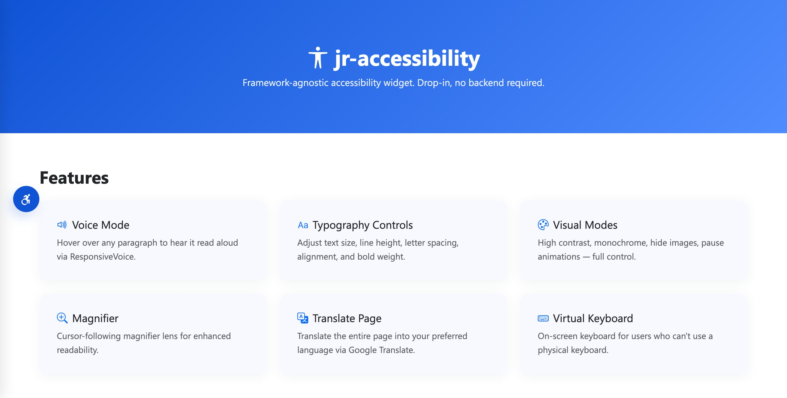
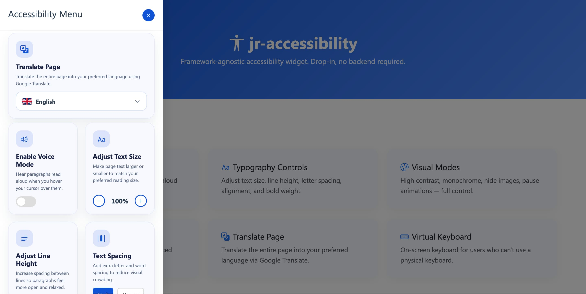

[](https://januriawan.my.id/jr-accessibility)




# jr-accessibility

Widget aksesibilitas **framework-agnostic** — bisa dipasang di project PHP apa pun, atau bahkan HTML statis tanpa backend sama sekali.

Modul ini menyediakan:
- **Accessibility Menu** (drawer) — voice mode, ukuran teks, line height, spacing, alignment, bold, reading guide, monochrome, high contrast, large cursor, magnifier, pause animations, hide images, virtual keyboard
- **Floating Sidebar** — tombol akses cepat
- **Translate Page** — integrasi Google Translate

---

## Struktur Folder

```
jr-accessibility/
├── README.md                          ← File ini
├── demo/
│   ├── demo.jpg
│   └── index.html                     ← Demo lengkap, buka di browser langsung jalan
└── public/
    └── assets/
        └── jr-accessibility/
            ├── css/style.css          ← Semua CSS (aksesibilitas + floating sidebar)
            ├── js/script.js           ← Semua JS (engine + translate)
            └── cursor/big-cursor.png  ← Gambar cursor untuk "Enlarge Cursor"
```

---

## Cara Pakai

### Langkah 1: Copy Assets

Copy folder `public/assets/jr-accessibility/` ke folder assets project kamu:

```
your-project/
├── index.html
└── assets/
    └── jr-accessibility/     ← copy ke sini
        ├── css/style.css
        ├── js/script.js
        └── cursor/big-cursor.png
```

### Langkah 2: Tambah CSS & JS ke HTML

Di file HTML kamu, tambahkan di `<head>` dan sebelum `</body>`:

```html
<head>
    <!-- Bootstrap Icons (wajib) -->
    <link rel="stylesheet" href="https://cdn.jsdelivr.net/npm/bootstrap-icons@1.11.3/font/bootstrap-icons.min.css">

    <!-- jr-accessibility CSS -->
    <link rel="stylesheet" href="assets/jr-accessibility/css/style.css">
</head>

<body>
    <!-- ... konten kamu ... -->

    <!-- ResponsiveVoice.js (opsional, hanya jika pakai Voice Mode) -->
    <script src="https://code.responsivevoice.org/responsivevoice.js"></script>

    <!-- jr-accessibility JS -->
    <script src="assets/jr-accessibility/js/script.js"></script>
</body>
```

### Langkah 3: Copy Widget HTML

Copy blok HTML widget dari file `demo/index.html` (bagian mulai dari `<div class="jr-reading-guide">` sampai sebelum `<!-- Scripts -->`) ke dalam `<body>` kamu.

Wrap konten utama kamu dengan `<div class="jr-page-root">...</div>` agar fitur seperti high contrast dan hide images bekerja dengan benar.

### Langkah 4: Test

Buka `demo/index.html` langsung di browser untuk lihat demo lengkap.

---

## Fitur Aksesibilitas

| Fitur | Deskripsi |
|-------|-----------|
| **Voice Mode** | Bacakan paragraf dengan suara saat hover |
| **Text Size** | Perbesar/kecil ukuran teks |
| **Line Height** | Atur jarak antar baris |
| **Text Spacing** | Atur jarak antar huruf dan kata |
| **Text Alignment** | Rata kiri/tengah/kanan/justify |
| **Bold Text** | Tebalkan semua teks |
| **Highlight Links** | Garis bantu baca & sorot link |
| **Monochrome Mode** | Ubah tampilan jadi grayscale |
| **High Contrast** | Tingkatkan kontras teks-latar |
| **Enlarge Cursor** | Kursor besar yang mudah dilihat |
| **Cursor Magnifier** | Kaca pembesar yang mengikuti kursor |
| **Pause Animations** | Hentikan animasi halaman |
| **Hide Images** | Sembunyikan gambar |
| **Virtual Keyboard** | Keyboard di layar |
| **Translate Page** | Terjemahkan halaman ke bahasa pilihan via Google Translate |

---

## Catatan Penting

- **Bootstrap Icons** wajib disertakan agar ikon muncul.
- **ResponsiveVoice.js** bersifat opsional — hanya diperlukan jika fitur Voice Mode digunakan.
- **Google Translate** membutuhkan koneksi internet (flag diambil dari flagcdn.com, engine dari Google).
- Widget ini **tidak memerlukan backend atau database** — semua fitur berjalan 100% di sisi klien.
